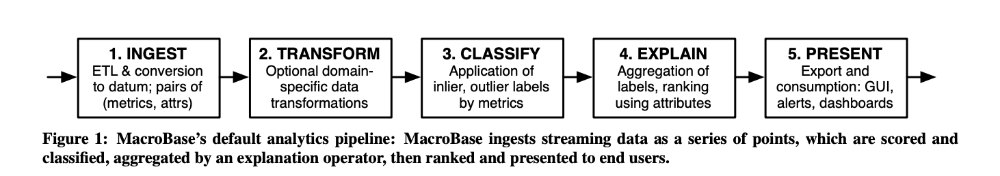
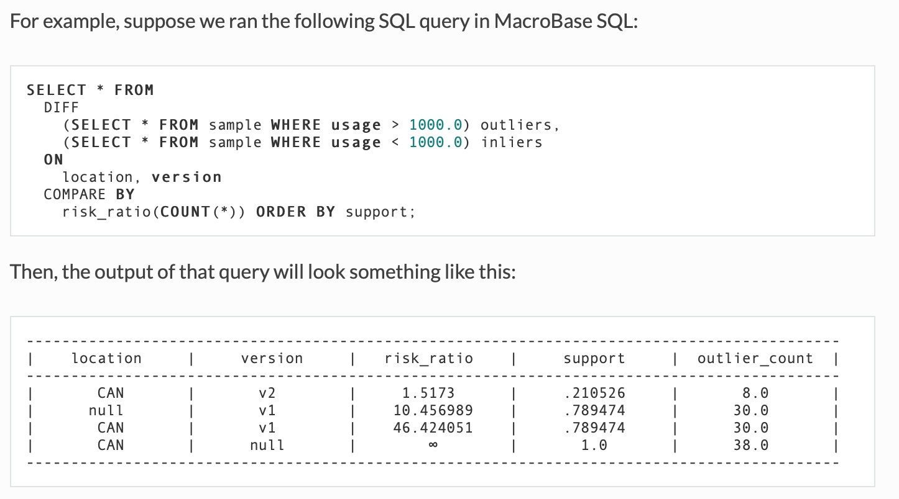

> #### [MacroBase](https://macrobase.stanford.edu/docs/)

- MacroBase is a new analytic monitoring engine designed to prioritize human attention in large-scale datasets and data streams using machine learning.
- specialises in - finding and explaining unusual or interesting trends in data.

MacroBase pipeline
- Ingestion -> Feature Transformation -> Classification -> Explanation -> Presentation

MacroBase architecture
- Ingestion
  -  ingests data streams for analysis from a number of external data sources. For example, MacroBase’s JDBC interface allows users to specify columns of interest from a base
view defined by a SQL query
- Transformation
  - domain specific data processing
  - dimensionality reduction
  - feature extraction
  - data fusion
  - streaming ETL
- Classification
  - segmentation based on target behaviours ( eg. abnormality)
  - Default behaviour : unsupervised density estimation
  - rule evaluation
  - supervised + unsupervised inference
  - operators simultaneously learn and infer labels
  - SIGMOID17 : new fast reservoir sampler
- Explanation
  - aggregation of streams into interpretable outputs by identifying commonalities , characteristics
    - eg . reading from android galaxy S5 devices running app version 52 are 30 times more likely than other to have abnormally high frequency
  - Default behaviour : relative risk calculation based on data attributes
  - SIGMOID17 : new update-optimized heavy-hitter sketch

SQL Interface
- MacroBase SQL
  - Extended the ANSI SQL standard with our MacroBase operators
  - DIFF
    - takes in two relations as arguments: the first relation is the outliers relation, while the second is the inliers relation. This represents the classification stage of the MacroBase pipeline. Important: both relations must share the same schema!
  - SPLIT
    - Manually specifying the outliers and inliers for your DIFF query can be a pain for users, especially if the inlier and outlier subqueries are quite redundant.To simplify, SPLIT segments a single relation in SQL into two distinct relations.

- 

Reference Docs

[MacroBase paper](./ref-docs/macrobase.pdf)
